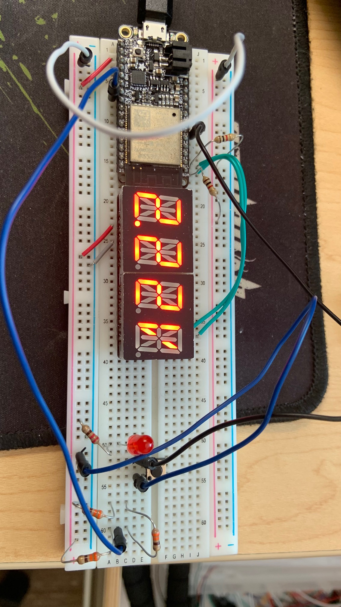

#  Skill Name

Author: Samuel Sze

Date: 2021-02-25
-----

## Summary
1. Review Voltage Divider circuits
2. Reviewed adc documentation on ESP website and course website
3. Integrated RTOS to include alphanumeric display. 
4. Build, flash and take photo of LED display. 

## Sketches and Photos

Image above shows a voltage divider of 20kohm from GND to Vin and 10kohm from Vin to Vcc. 

This means that the output voltage should be 2/3 of the input voltage. 

Since the input voltage is 3.3V, the LED displays the correct value of 2.22V. 

## Modules, Tools, Source Used Including Attribution
Sources: 

    1. https://docs.espressif.com/projects/esp-idf/en/latest/esp32/api-reference/peripherals/adc.html#_CPPv416adc_bits_width_t
    2. http://whizzer.bu.edu/skills/battery-monitor
    
## Supporting Artifacts
-----