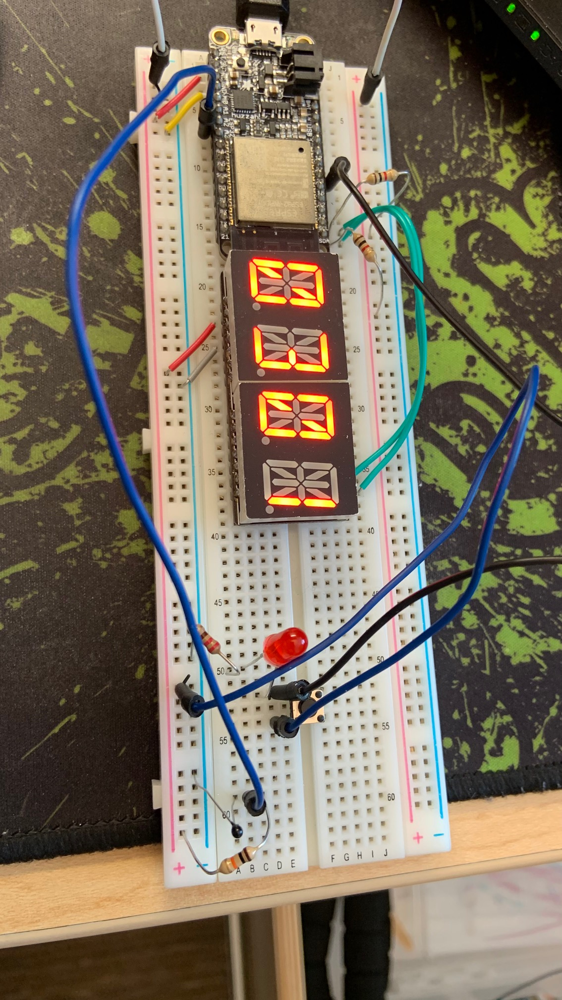

#  Skill Name

Author: Samuel Sze

Date: 2021-02-25
-----

## Summary
1. Review Voltage Divider circuits, substitute some resistors for thermistor.
2. Measure thermistor resistance using multimeter.
3. Reviewed adc documentation on ESP website and course website
4. Integrated RTOS to include alphanumeric display. 
5. Use steinhard-Hart equation to convert thermistor resistance into temperature in kelvin.
5. Build, flash and take photo of LED display. 

## Sketches and Photos

Image above shows a thermistor from GND to Vin and 10kohm from Vin to Vcc. 

This means that as the ambient temperature changes, the voltage/resistance across the thermistor changes. 

This change is converted to temperature, which indicates a temperature of 301K, which is about 27 celsius. 

This means that the converting equation used is correct. 

## Modules, Tools, Source Used Including Attribution
Sources: 

    1. https://docs.espressif.com/projects/esp-idf/en/latest/esp32/api-reference/peripherals/adc.html#_CPPv416adc_bits_width_t
    2. http://whizzer.bu.edu/skills/thermistor
    3. https://en.wikipedia.org/wiki/Steinhart%E2%80%93Hart_equation
    
## Supporting Artifacts
-----