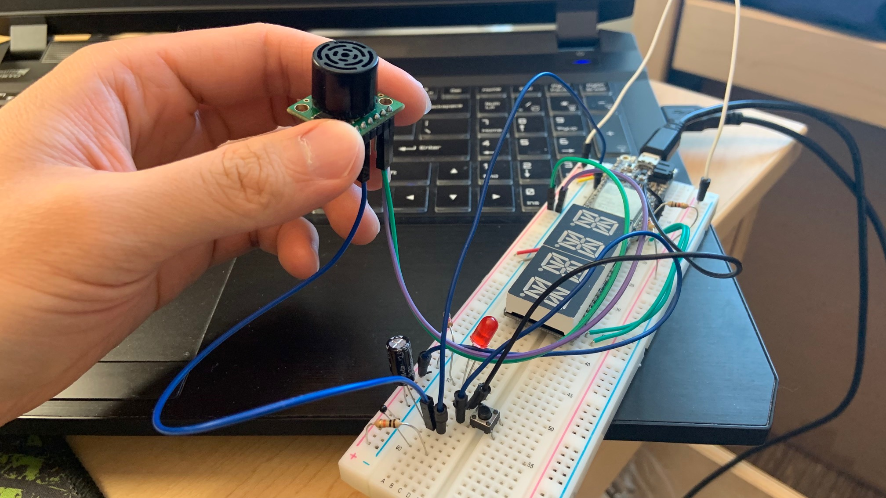
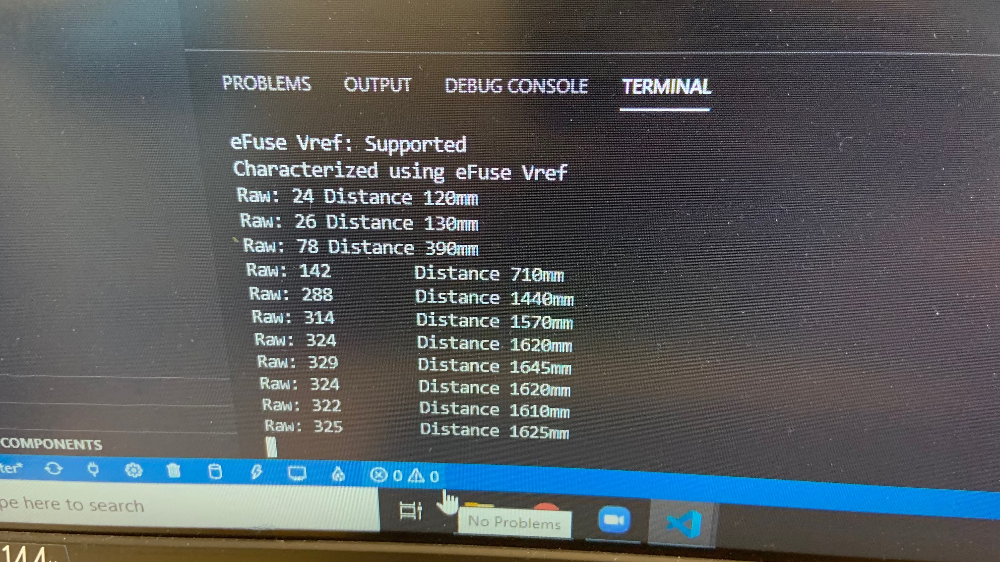

#  Ultrasonic sensor

Author: Samuel Sze

Date: 2021-03-04
-----

## Summary
1. Read through datasheet on MaxBotix to find conversion parameters. 
2. Wire Ultrasonic sensor to board.
3. Use the analog signal with capacitor to reduce noise.
4. Use appropriate conversion (10bit width) to convert adc_reading into distance measurements (cm)
5. Build, flash and take photo of setup.

## Sketches and Photos

Image above shows ultrasonic sensor connected to 3.3Vin and GND, the analog voltage pin connected to GPIO 34 and goes over a capacitor. 

The ultrasonic sensor points towards the ceiling. 

Another image shows the distance display on console terminal. The distance shows about 1.6m, which is the correct distance from my roof to my desk (measured using measuring tape)

## Modules, Tools, Source Used Including Attribution
Sources: 

    1. https://docs.espressif.com/projects/esp-idf/en/latest/esp32/api-reference/peripherals/adc.html#_CPPv416adc_bits_width_t
    2. http://whizzer.bu.edu/skills/ultrasonic1
    3. https://www.maxbotix.com/documents/HRLV-MaxSonar-EZ_Datasheet.pdf
    
## Supporting Artifacts
-----