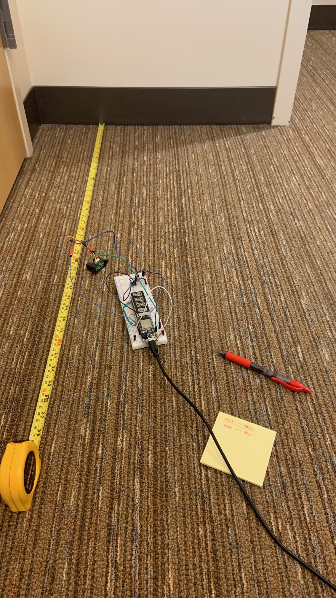
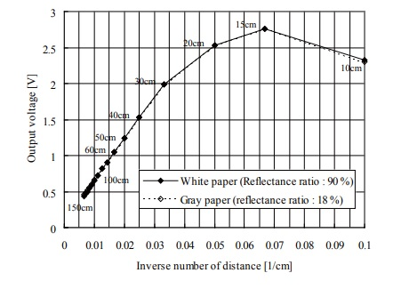

#  IR sensor

Author: Samuel Sze

Date: 2021-03-04
-----

## Summary
1. Read through datasheet on SharpIR to find conversion parameters. 
2. Wire IR sensor to board.
3. Use the analog signal with capacitor to reduce noise.
4. Use appropriate conversion (12bit width) to convert adc_reading into distance measurements (cm)
5. Build, flash and take photo of setup.

## Sketches and Photos

IR sensor is connected to USB Vin and GND, the analog voltage pin connected to GPIO 34 and goes over a 100uF capacitor. 

Conversion from voltage to distance is down by looking at the above graph shown in the SharpIR datasheet. 

The graph is split into different linear curves for different voltage values. The accurate range of this sensor is from 15cm to 150cm. 

The IR sensor is being calibrated using a measured distance to make sure the conversion using the graph is correct. 

## Modules, Tools, Source Used Including Attribution
Sources: 

    1. https://docs.espressif.com/projects/esp-idf/en/latest/esp32/api-reference/peripherals/adc.html#_CPPv416adc_bits_width_t
    2. https://www.sparkfun.com/datasheets/Sensors/Infrared/gp2y0a02yk_e.pdf
    3. http://whizzer.bu.edu/skills/ir
    
## Supporting Artifacts
-----