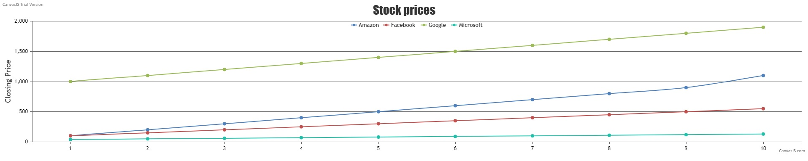

#  Canvasjs

Author: Samuel Sze

Date: 2021-03-04
-----

## Summary
1. Read through canvasjs examples and documentations
2. Install necessary components (canvasjs)
3. Read through csv integration to canvasjs (filestream).
4. Read through socketio integration to canvasjs (socket.io).
5. Write javascript to read in stocks csv text from course website and emit the graph through canvasjs onto local host. 

    a). Parse in data into separately declared variable arrays for each stock. 

## Sketches and Photos

## Modules, Tools, Source Used Including Attribution
Sources: 

    1. http://whizzer.bu.edu/skills/canvasjs
    2. https://canvasjs.com/
    3. https://socket.io/get-started/chat/
    
## Supporting Artifacts
-----