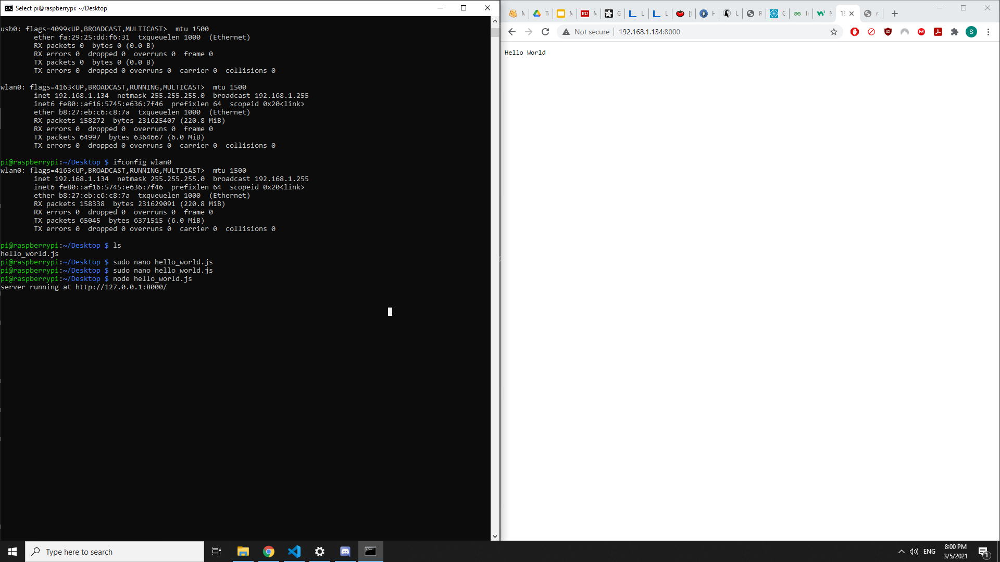
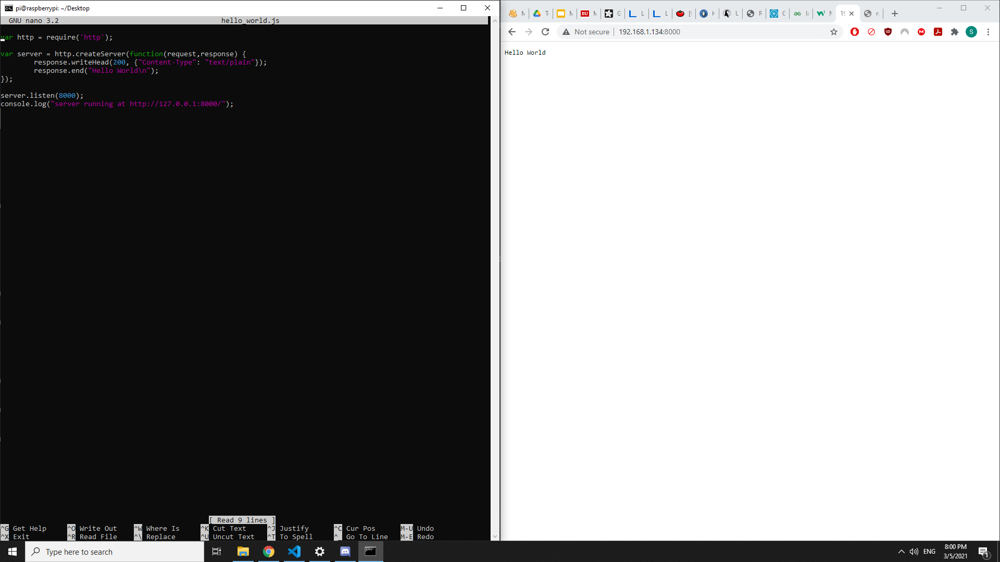

#  Raspberry Pi

Author: Samuel Sze

Date: 2021-03-04
-----

## Summary
1. Read through Adafruit headless install guide.
2. Follow steps to flash raspberry pi image onto microSD card.
3. Used course router connected to ethernet to setup private Wireless network "Group_5".
4. Edit appropriate text files to connect raspberry pi to WIFI and allow ssh. 
5. SSH into raspberry pi using its displayed IP address.
6. Install node.js on pi. 
7. Type out "hello world" javascript on pi.
8. Run hello world server on pi.
9. Verify web server by checking on laptop on appropriate IP address port. 
10. Take screenshot to verify that the web server on pi is established. 

## Sketches and Photos

## Modules, Tools, Source Used Including Attribution
Sources: 

    1. http://whizzer.bu.edu/skills/rpi
    2. https://learn.adafruit.com/raspberry-pi-zero-creation
    3. https://www.raspberrypi.org/software/
    

## Supporting Artifacts

-----
