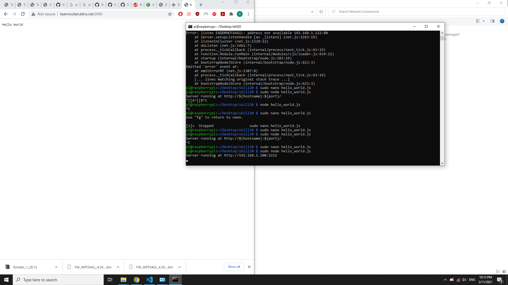

#  Dynamic DNS

Author: Samuel Sze
Date: 2021-03-11
-----

## Summary
Use DDNS to access web server in raspberry pi from external internet cloud. 
1. Setup webserver in pi on loan router LAN using node.js (ip address at 192.168.1.100, port at 2222)
2. Setup up DDNS service from no-ip and configure it onto loan router.
3. Setup port forwarding on loan router (external port 3000, internal port 2222).
4. Run webserver, use DDNS to access webserver from BU WIFI.

## Sketches and Photos

## Modules, Tools, Source Used Including Attribution

## Supporting Artifacts

-----
