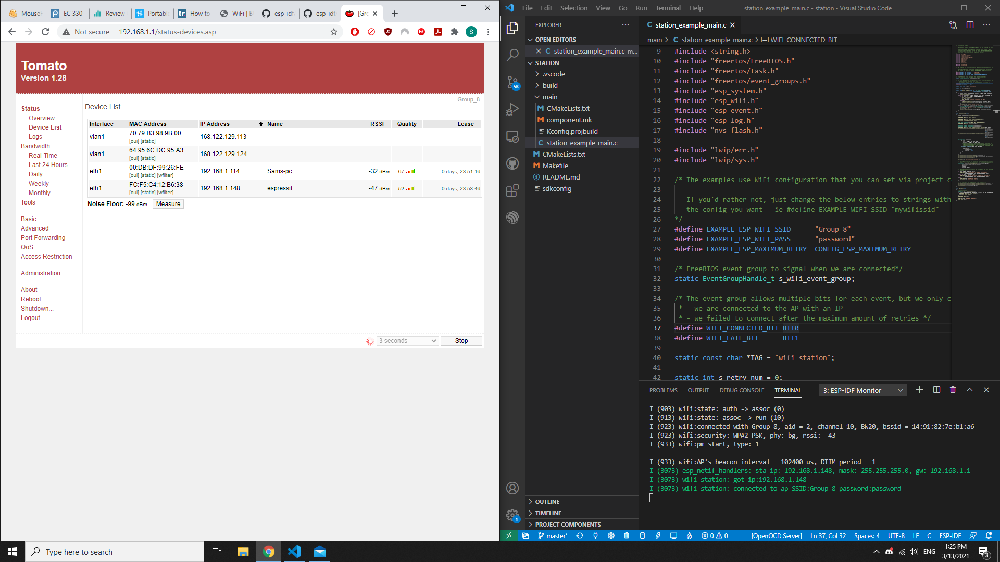

#  ESP32 Wifi

Author: Samuel Sze
Date: 2021-03-13
-----

## Summary
Setup ESP32 Wifi on Loan Router
1. Follow example project wifi-station.
2. Change necessary parameters to connect esp32 to router.
3. Build, flash, take screenshot

## Sketches and Photos

## Modules, Tools, Source Used Including Attribution
Sources:

    1. https://github.com/espressif/esp-idf/tree/master/examples/wifi/getting_started/station
    
    2. http://whizzer.bu.edu/skills/wifi

## Supporting Artifacts