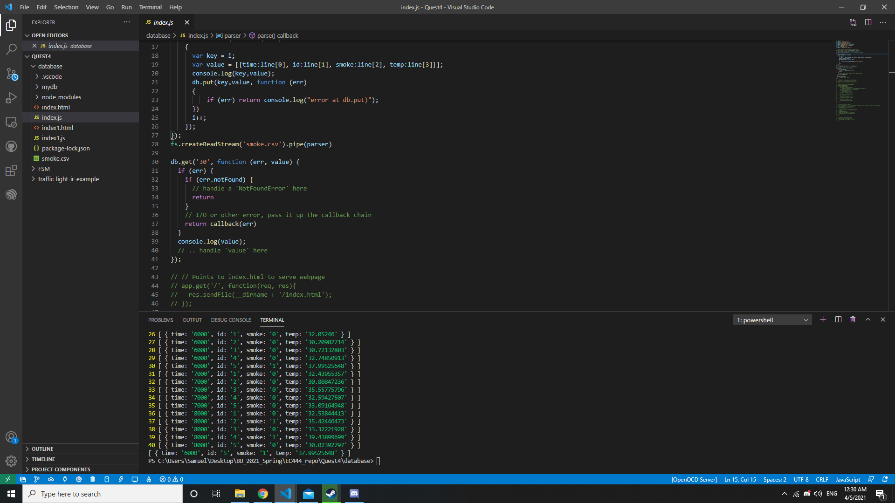

#  ESP32 Database 

Author: Samuel Sze

Date: 2021-04-05

-----

## Summary
1. Read up on leveldb implementation on nodejs platform. 

2. Create filestream and leveldb to parse smoke.csv information into database using db.put. 

3. Use iterator as unique key.

4. Use db.get to query the database together with the key. 

## Sketches and Photos

Image shows query of the 30th entry, which returns the correct row from the database.

## Modules, Tools, Source Used Including Attribution
Sources:

    1. http://whizzer.bu.edu/skills/tingodb

    2. https://dbdb.io/db/leveldb

    3. https://www.npmjs.com/package/node-leveldb

## Supporting Artifacts
