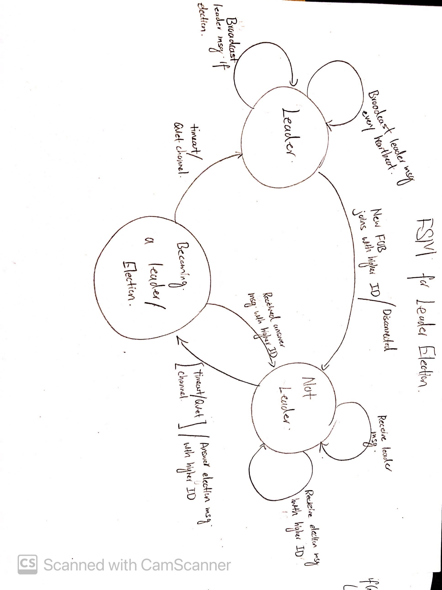

#  ESP32 Leader Election

Author: Samuel Sze

Date: 2021-04-07

-----

## Summary
1. Model Bully Algorithm with state model

2. Test out UDP multicast code from esp github repo.

3. Implement bully algorithm onto UDP multicast project.

4. Test out scenario where leader fails and new leader get elected

5. Test out scenario where leader comes back online.

## Sketches and Photos

## Modules, Tools, Source Used Including Attribution
Sources:

    1. http://whizzer.bu.edu/skills/state-models

    2. http://whizzer.bu.edu/briefs/design-patterns/dp-state-machine

## Supporting Artifacts
Link to video artifact: 

    https://drive.google.com/file/d/1fg6vKTI1iRycrQiLBx3C5z9y23z6v_hj/view?usp=sharing

Video shows the following:
-  UDP server on nodejs listening to a multicast port.

-  Starts off with FOB with ID3 becoming leader (l3)

- l3 disconnects, FOB2 timeouts, FOB2 decides to hold election, sends election msg (e2), timeouts, FOB2 elects itself to be leader (l2)

- FOB with ID3 reconnects, upon receiving l2 broadcast, replies back with l3, forcing l2 to be a normal FOB once again. 

- l3 continues leader broadcast.