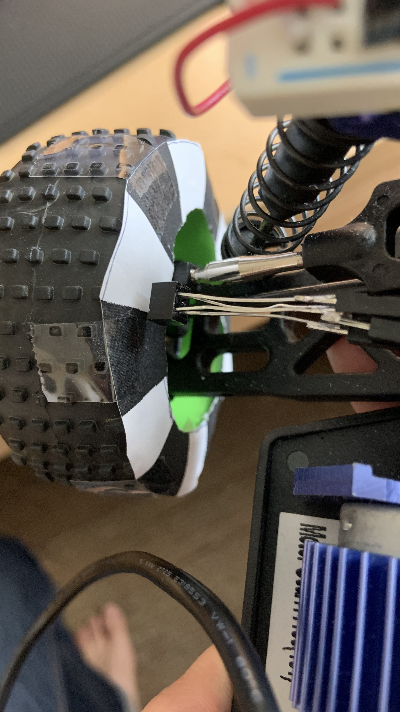

#  Encoder Wheel Speed

Author: Samuel Sze

Date: 2021-04-23
-----

## Summary

1. Print and cut encoder template from course website. Fit it to size on the buggy's wheel. 

2. Wire up the optical emitter accordingly and align it close to the encoder template on the buggy's wheel. 

3. Detect transition from black edge to white edge (falling edge), which means 7 of these falling edges will result in one full revolution. 

4. Calculate the speed of the buggy based on the following equation:

        Linear Speed = [(1rev)/(time in seconds for 7 falling edges)] * circumference of wheel

## Sketches and Photos

## Modules, Tools, Source Used Including Attribution

Sources:

    1. http://whizzer.bu.edu/skills/wheel-speed

    2. https://learn.sparkfun.com/tutorials/qrd1114-optical-detector-hookup-guide#example-circuit

## Supporting Artifacts

-----
